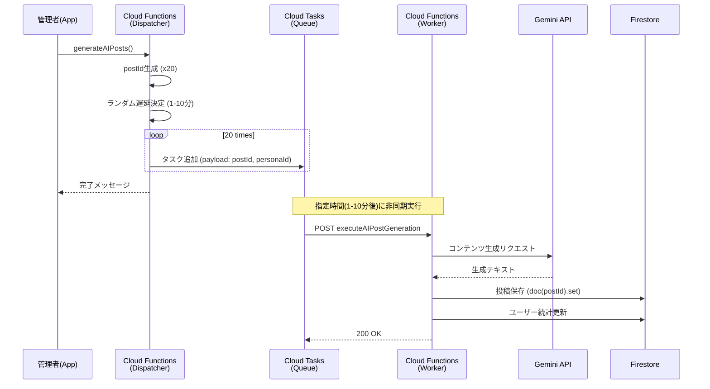

# 管理者機能 設計書

## 概要

本ドキュメントでは、アプリの運営・管理を行う「管理者機能」について記述します。

### 管理者権限システム
Firebase Custom Claimsベースの動的管理。詳細は [3.1 管理者権限システム](#31-管理者権限システム-2026-01-03-custom-claims移行) を参照。

### 機能一覧

| セクション | 機能 | 状態 |
|-----------|------|------|
| 1. AIアカウント管理 | AI生成・削除・整合性チェック | ✅ 実装済 |
| 2. AI投稿生成 | Dispatcher-Workerパターン | ✅ 実装済 |
| 3. 要審査投稿レビュー | フラグ付き投稿の審査 | ✅ 実装済 |
| 4. 管理者通知 | フラグ付き投稿通知 | ✅ 実装済 |
| 5. 問い合わせ機能 | チケット形式対応・スプレッドシート連携 | ✅ 実装済 |
| 6. 通報機能 | コンテンツ単位グループ化UI | ✅ 実装済 |
| 7. サークル管理者権限 | 全サークルへのオーナー権限 | ✅ 実装済 |
| 8. ユーザーBAN機能 | 一時BAN/永久BAN/異議申し立てチャット | ✅ 実装済 |

## 1. AIアカウント管理

### 1.1 AIアカウント生成・更新 (`initializeAIAccounts`)
事前定義されたペルソナデータ（`AI_PERSONAS`）に基づき、20体のAIユーザーを一括生成または更新します。

- **トリガー**: `onCall` (管理者クライアントから呼び出し)
- **処理内容**:
    1. `AI_PERSONAS` 定数（20体）をループ処理。
    2. Gemini APIを使用して、各ペルソナの性格・職業に合わせた **Bio（自己紹介文）** を動的に生成。
    3. Firestore `users` コレクションに保存/更新。
        - `isAI: true` フラグを付与。
        - 名前、アバター、属性（年代、職業、性格）を保存。
- **目的**: テスト用データのセットアップ、AIキャラの質の向上。

### 1.2 AIアカウント全削除 (`deleteAllAIUsers`)
作成されたAIアカウントと、それに関連するデータを完全に削除します。

- **トリガー**: `onCall`
- **処理内容**:
    1. Firestore `users` コレクションから `isAI: true` のドキュメントを検索。
    2. 以下のデータをバッチ処理で削除:
        - AIのユーザープロファイル
        - AIが投稿した `posts`
        - AIが行った `comments`
        - AIが行った `reactions`
        - AIユーザーのサブコレクション（`notifications` など）
- **安全策**: 誤操作防止のため、クライアント側で「本当に削除しますか？」の確認ダイアログを実装済み。

### 1.3 フォロワー整合性チェック (`cleanUpUserFollows`)
削除されたユーザーがフォロー/フォロワーリストに残っている場合の整合性エラーを修正します。

- **トリガー**: `onCall`
- **処理内容**:
    1. 全ユーザーの `following` 配列をスキャン。
    2. 存在しないユーザーIDが含まれている場合、それを削除し、`followingCount` を再計算して更新。

## 2. AI投稿生成システム（Cloud Tasks連携）

タイムアウト（`DEADLINE_EXCEEDED`）の回避と、人間らしい自然な投稿頻度を実現するため、**Dispatcher-Workerパターン** を採用しています。

### 2.1 投稿生成ディスパッチャー (`generateAIPosts`)
投稿生成タスクをスケジュールする「司令塔」の役割を果たします。

- **トリガー**: `onCall` (管理者ボタン)
- **処理内容**:
    1. 全AIペルソナ（20体）をループ。
    2. **冪等性の担保**: 事前に `postId` を生成（`db.collection("posts").doc().id`）。
    3. **ランダム遅延**: 現在時刻から **1分〜10分** の間でランダムな実行時刻を決定。
    4. **タスク作成**: Cloud Tasks の `generate-ai-posts` キューにタスクを追加。
        - Payload: `postId`, `personaId`, `postTimeIso`

### 2.2 投稿生成ワーカー (`executeAIPostGeneration`)
実際にGemini APIを呼び出し、投稿を作成する「実務者」の役割です。

- **トリガー**: `onRequest` (Cloud Tasks からの HTTP POST)
- **URL**: `https://asia-northeast1-positive-sns.cloudfunctions.net/executeAIPostGeneration`
- **処理内容**:
    1. **認証**: 簡易的なBearerトークンチェック（将来的にはOIDC推奨）。
    2. **コンテンツ生成**: Gemini 2.0 Flash を使用し、ペルソナの性格・職業・現在の時間帯に合わせた「日常の努力・達成」に関する投稿文を生成。
    3. **投稿保存**: ディスパッチャーから受け取った `postId` を使用してFirestoreに保存（冪等性により、リトライ時の重複を防ぐ）。
    4. **統計更新**: ユーザーの `totalPosts` などを更新。

### 2.3 システム構成図



## 3. 要審査投稿レビュー

フラグ付き投稿（モデレーションで曖昧判定されたもの）を管理者がレビュー・判断する機能。

### 3.1 管理者権限システム (2026-01-03 Custom Claims移行)

**従来**: ハードコードされたUID
**現在**: Firebase Custom Claimsベースの動的管理

#### 仕組み

| 項目 | 詳細 |
|------|------|
| 管理者判定 | `request.auth.token.admin == true` |
| 権限付与 | `setAdminRole` Cloud Function |
| 権限削除 | `removeAdminRole` Cloud Function |
| クライアント判定 | `isAdminProvider` (Custom Claims取得) |

#### Cloud Functions

| 関数名 | 説明 |
|--------|------|
| `setAdminRole` | 対象ユーザーに管理者権限を付与（既存管理者のみ実行可能） |
| `removeAdminRole` | 対象ユーザーの管理者権限を削除（自分自身は削除不可） |

#### 初期設定

```bash
# 初期管理者の設定
cd functions
node scripts/set_initial_admin.js
```

詳細手順: [setup_admin_custom_claims.md](../admin/setup_admin_custom_claims.md)

#### セキュリティルール

```javascript
// firestore.rules
function isAdmin() {
  return request.auth != null && request.auth.token.admin == true;
}
```

### 3.2 レビュー画面
| 項目 | 詳細 |
|------|------|
| 画面 | `AdminReviewScreen` |
| ルート | `/admin/review` |
| トリガー | 🚩アイコンタップ（管理者のみ表示） |

### 3.3 アクション
- **承認**: `needsReview: false`に更新、`pendingReviews`を`reviewed: true`に
- **削除**: 投稿削除 + Storageメディア削除
- **投稿詳細**: 該当投稿画面へ遷移

### 3.4 pendingReviewsコレクション
```typescript
{
  postId: string,
  userId: string,
  reason: string,
  createdAt: Timestamp,
  reviewed: boolean,
}
```

### 3.5 Firestoreインデックス
```json
{
  "collectionGroup": "pendingReviews",
  "fields": [
    { "fieldPath": "reviewed", "order": "ASCENDING" },
    { "fieldPath": "createdAt", "order": "DESCENDING" }
  ]
}
```

## 4. 管理者通知

フラグ付き投稿発生時に管理者へ通知。

### 4.1 通知方法
| 方法 | 詳細 |
|------|------|
| **アプリ内通知** | `users/{adminId}/notifications`に追加 |
| **FCM通知** | プッシュ通知 |

### 4.2 通知データ
```typescript
{
  type: "review_needed",
  title: "要審査投稿",
  body: "フラグ付き投稿があります: {理由}",
  postId: "{postId}",
  fromUserId: "{投稿者ID}",
  fromUserName: "{投稿者名}",
}
```

## 5. 問い合わせ・要望機能

ユーザーからの問い合わせや機能要望を受け付け、管理者が返信できるチケット形式の機能。

### 5.1 概要

| 項目 | 詳細 |
|------|------|
| コミュニケーション方式 | チケット形式（複数往復可） |
| 既読管理 | ✅ あり（未読マーク表示） |
| 添付ファイル | ✅ スクリーンショット可 |
| 返信者名 | 「運営チーム」で統一 |
| ステータス管理 | 管理者が手動で変更 |

### 5.2 データ構造

#### inquiriesコレクション
```typescript
{
  userId: string,           // 送信者UID
  userDisplayName: string,  // 送信者名
  userAvatarIndex: number,  // 送信者アバター
  category: string,         // "bug" | "feature" | "account" | "other"
  subject: string,          // 件名
  status: string,           // "open" | "in_progress" | "resolved"
  hasUnreadReply: boolean,  // ユーザー向け未読
  hasUnreadMessage: boolean, // 管理者向け未読
  createdAt: Timestamp,
  updatedAt: Timestamp
}
```

#### messagesサブコレクション
```typescript
{
  senderId: string,
  senderName: string,       // ユーザー名 or "運営チーム"
  senderType: string,       // "user" | "admin"
  content: string,
  imageUrl: string | null,
  createdAt: Timestamp
}
```

### 5.3 実装ファイル

| ファイル | 内容 |
|----------|------|
| `lib/shared/services/inquiry_service.dart` | 問い合わせサービス |
| `lib/features/settings/presentation/screens/inquiry_list_screen.dart` | ユーザー用一覧画面 |
| `lib/features/settings/presentation/screens/inquiry_form_screen.dart` | 新規フォーム |
| `lib/features/settings/presentation/screens/inquiry_detail_screen.dart` | ユーザー用詳細画面 |
| `lib/features/admin/presentation/screens/admin_inquiry_list_screen.dart` | 管理者用一覧画面 |
| `lib/features/admin/presentation/screens/admin_inquiry_detail_screen.dart` | 管理者用詳細画面（返信・ステータス変更） |

### 5.4 Cloud Functions

| 関数名 | トリガー | 説明 |
|--------|----------|------|
| `createInquiry` | onCall | 新規問い合わせ作成（管理者通知・プッシュ通知付き） |
| `sendInquiryMessage` | onCall | ユーザーからのメッセージ送信（管理者通知・プッシュ通知付き） |
| `sendInquiryReply` | onCall | 管理者からの返信（ユーザー通知・プッシュ通知付き） |
| `updateInquiryStatus` | onCall | ステータス変更（ユーザー通知・プッシュ通知付き） |

### 5.5 通知連携 ✅ 実装済み（2025-12-29）

#### 通知タイプ
| 通知タイプ | タイミング | 送信先 |
|-----------|-----------|--------|
| `inquiry_received` | 新規問い合わせ作成時 | 管理者 |
| `inquiry_user_reply` | ユーザーが返信した時 | 管理者 |
| `inquiry_reply` | 運営が返信した時 | ユーザー |
| `inquiry_status_changed` | ステータス変更時 | ユーザー |

#### 通知画面のタブ
- TL → タスク → サークル → **サポート**（問い合わせ通知専用）

### 5.6 Phase 5: 自動クリーンアップ＆スプレッドシート連携

#### 5.6.1 自動クリーンアップ（実装済み・テスト待ち 2025-12-31）

| 項目 | 詳細 |
|------|------|
| 削除トリガー | ステータスが「解決済み」から7日経過 |
| 削除対象 | 問い合わせ本体 + メッセージ + 添付画像（Storage） |
| アーカイブ | `inquiry_archives`コレクションに1年保存 |
| 削除前通知 | 前日にプッシュ通知＋アプリ内通知（サポートタブ）でユーザーに通知 |

#### 5.6.2 Googleスプレッドシート連携 ✅ 実装済み（2025-12-30）

| 項目 | 詳細 |
|------|------|
| 連携方式 | Google Sheets API 直接連携 |
| タイミング | ステータスを「解決済み」に変更時（管理者がダイアログで選択） |
| 用途 | 機能要望などの長期管理（Excel取り込み→要望管理） |

##### 解決時ダイアログUI

**初期状態（チェックなし）**
```
┌─────────────────────────────────────────┐
│  ステータスを「解決済み」に変更          │
├─────────────────────────────────────────┤
│  □ スプレッドシートに記録する           │
│         [キャンセル]    [解決済みにする]│
└─────────────────────────────────────────┘
```
→ 解決済みにする → ステータス変更のみ

**チェックあり（展開状態）**
```
┌─────────────────────────────────────────┐
│  ステータスを「解決済み」に変更          │
├─────────────────────────────────────────┤
│  ☑ スプレッドシートに記録する           │
│                                         │
│  【解決後カテゴリ】                     │
│  ◯ 対応予定  ◯ 要検討  ◯ 対応必須      │
│  ◯ 対応不要  ◯ 完了                    │
│                                         │
│  【備考（任意）】                       │
│  ┌─────────────────────────────────────┐ │
│  │                                     │ │
│  └─────────────────────────────────────┘ │
│         [キャンセル]    [解決済みにする]│
└─────────────────────────────────────────┘
```
→ 解決済みにする → ステータス変更 + スプレッドシート追記

##### 解決後カテゴリ

| カテゴリ | 説明 |
|---------|------|
| 対応予定 | 今後のリリースで対応（機能要望採用） |
| 要検討 | 判断材料不足、情報収集必要 |
| 対応必須 | 優先度高、早急に対応（重大バグ等） |
| 対応不要 | 仕様通り、または再現不可 |
| 完了 | 既に対応済み |

##### スプレッドシート列構成

| 列 | 項目 | 説明 |
|----|------|------|
| A | 日時 | 問い合わせ作成日時 |
| B | UID | ユーザーUID |
| C | カテゴリ | バグ報告/機能要望/アカウント関連/その他 |
| D | 件名 | 問い合わせ件名 |
| E | 内容 | 最初のメッセージ |
| F | 会話全文 | 全メッセージを連結したテキスト |
| G | 解決日 | 解決済みにした日時 |
| H | 解決後カテゴリ | 対応予定/要検討/対応必須/対応不要/完了 |
| I | 備考 | 管理者が入力した備考 |

##### 会話全文の形式
```
[2025-12-29 10:00 ユーザー]
アプリが起動しません

[2025-12-29 10:30 運営チーム]
お問い合わせありがとうございます。

[2025-12-29 10:45 ユーザー]
iOS 17でクラッシュします
```

#### 実装フロー
```
1. 管理者がステータス「解決済み」を選択
2. ダイアログ表示
   - チェックなし → ステータス変更のみ
   - チェックあり → カテゴリ・備考入力
3. updateInquiryStatus (Cloud Functions)
   - ステータス更新
   - スプレッドシート記録フラグがONの場合:
     → 全メッセージを取得して連結
     → Google Sheets APIでスプレッドシートに追記
   - ユーザーに通知
4. 6日後: 削除予告通知（Cloud Scheduler）
5. 7日後: 本体削除（Cloud Scheduler）
```

#### 必要な設定（1回のみ）
1. Google Cloud Console でサービスアカウント作成
2. Sheets API 有効化
3. スプレッドシートをサービスアカウントに共有
4. Secret Manager にJSONキー登録

## 6. 通報機能

### 6.1 概要

ユーザーからの通報を管理者が確認・対処できる機能。コンテンツ（投稿/コメント）単位でグループ化されたUIを提供。

### 6.2 実装ファイル

| 機能 | ファイル |
|------|----------|
| 通報ダイアログ | `lib/shared/widgets/report_dialog.dart` |
| 通報サービス | `lib/shared/services/moderation_service.dart` |
| 通報一覧画面 | `lib/features/admin/presentation/screens/admin_reports_screen.dart` |
| 通報詳細画面（コンテンツ単位） | `lib/features/admin/presentation/screens/admin_report_content_screen.dart` |
| Cloud Functions | `reportContent` |

### 6.3 仕様

| 項目 | 仕様 |
|------|------|
| 重複通報 | 1ユーザー1投稿につき1回まで |
| 通報閾値 | 5件で自動非表示化（`isVisible: false`） |
| 非表示通知 | 投稿者に `post_hidden` 通知 |
| 問題なし判定 | 再表示（`isVisible: true`） + 全通報を対応済みに |
| 通報者通知 | 通報時に「審査します」メッセージ |

### 6.4 投稿の表示/非表示フィールド

`isVisible` フィールドで統一管理：

| `isVisible` | 意味 | TL表示 |
|-------------|------|--------|
| `true` | 通常表示 | ✅ 表示 |
| `false` | 非表示（通報5件で自動設定） | ❌ 非表示 |

### 6.5 対処アクション

| アクション | 説明 | 実装状況 |
|-----------|------|----------|
| 問題なし | 投稿を再表示 + 全通報を対応済み | ✅ 完了 |
| 投稿削除 | 投稿を削除 + `post_deleted` 通知 | ✅ 完了 |
| 虚偽判定 | 通報を却下 | ✅ 完了 |
| ユーザーBAN | アカウントを停止 | ❌ 未実装 |

### 6.6 管理者画面 (2026-01-02 改善)

#### 一覧画面（コンテンツ単位グループ化）
- 同一投稿への複数通報を1カードに集約
- 通報件数バッジ表示
- 投稿プレビュー + 非表示ステータス表示

#### 詳細画面（コンテンツ単位）
- 上部: 投稿内容 + 投稿者情報（累計通報数）
- 中部: 通報者一覧（スクロール可能）
  - 通報者アバター、名前、通報理由、時間
  - 各通報者の累計通報回数
  - タップでプロフィール遷移
- 下部: アクションボタン（問題なし / 投稿削除）

### 6.7 データ構造

```typescript
// reports コレクション
{
  contentId: string,      // 投稿ID or コメントID
  contentType: string,    // 'post' | 'comment'
  reporterId: string,     // 通報者UID
  targetUserId: string,   // 被通報者UID
  reason: string,         // 通報理由
  details: string,        // 詳細
  status: string,         // 'pending' | 'resolved' | 'dismissed'
  createdAt: Timestamp,
  reviewedAt: Timestamp,  // 対処日時
}
```

### 6.8 通知タイプ

| 通知タイプ | 対象者 | トリガー |
|-----------|--------|---------|
| `admin_report` | 管理者 | 新規通報受信時 |
| `post_deleted` | 被通報ユーザー | 管理者による投稿削除時 |
| `post_hidden` | 被通報ユーザー | 通報5件で自動非表示時 |

## 7. サークルに対する管理者権限（計画中）

### 7.1 概要

管理者は全サークルに対してオーナー同等の権限を持つ。

### 7.2 権限一覧

| 機能 | 管理者 |
|------|--------|
| サークル内投稿（未参加でも） | ✅ |
| 投稿ピン留め | ✅ |
| サークル編集 | ✅ |
| サークル削除 | ✅ |
| 投稿削除 | ✅ |

### 7.3 ユースケース

- 副オーナー未設定でオーナーがBANされた場合の対応
- 荒らし投稿の緊急削除
- サークル運営の健全化支援

---

## 8. ユーザーBAN機能（計画中）

### 8.1 概要

悪質ユーザーへの対応として、2段階のBAN機能を実装する。
一時BAN（機能制限）と永久BAN（アカウント凍結）を使い分け、誤BAN防止と復帰可能性を担保する。

### 8.2 BAN状態の種類

| 状態 | 説明 | ログイン | 機能 |
|------|------|---------|------|
| `none` | 通常 | ✅ | ✅ 全機能 |
| `temporary` | 一時BAN | ✅ | ⚠️ 自分のプロフィールのみ閲覧可 |
| `permanent` | 永久BAN | ❌ | ❌ ログイン不可 |

### 8.3 一時BAN

#### トリガー
管理者がユーザープロフィール画面から「BANする」ボタンを押下

#### 制限内容

| 機能 | 制限 |
|------|------|
| タイムライン閲覧 | ❌ 不可 |
| 投稿作成 | ❌ 不可 |
| コメント・リアクション | ❌ 不可 |
| サークル | ❌ 不可 |
| タスク・目標 | ❌ 不可 |
| 自分のプロフィール閲覧 | ✅ 可 |
| 管理者との対応画面 | ✅ 可 |

#### BAN対応画面
管理者と被BANユーザーがコミュニケーションを取るための専用画面。

### 8.4 永久BAN

#### トリガー
管理者がBAN対応画面で「永久BANにする」を選択

#### 挙動

| 項目 | 詳細 |
|------|------|
| ログイン | ❌ 不可 |
| データ保持 | 半年間保持 |
| 復帰 | 半年以内であれば可能（管理者判断） |
| データ削除 | 半年後に自動削除 |

#### 既存投稿の扱い
表示継続（削除すると他ユーザーに影響）

### 8.5 サークルオーナーがBANされた場合

#### 一時BAN時

| シナリオ | 対応 |
|---------|------|
| 副オーナーあり | 副オーナーに通知、サークル運営継続 |
| 副オーナーなし | 管理者がサークル内投稿で次期オーナーを募集 |

#### 永久BAN時

| シナリオ | 対応 |
|---------|------|
| 副オーナーあり | 副オーナーがオーナーに自動昇格、通知 |
| 副オーナーなし（対応あり） | 管理者募集後、新オーナー決定でサークル継続 |
| 副オーナーなし（対応なし） | 管理者がサークル削除 |
| オーナー＆副オーナー両方BAN | サークル自動削除、メンバーに通知 |

#### 一時BANから復帰時
- オーナー → 副オーナーに降格
- 現オーナー（元副オーナー）が許可すればオーナーに復帰可能

### 8.6 データ構造

#### usersコレクション追加フィールド

```typescript
{
  banStatus: 'none' | 'temporary' | 'permanent',
  banHistory: [
    {
      type: 'temporary' | 'permanent',
      reason: string,           // BAN理由
      bannedAt: Timestamp,
      bannedBy: string,         // 管理者UID
      resolvedAt: Timestamp?,
      resolution: 'cleared' | 'escalated' | null
    }
  ],
  permanentBanScheduledDeletionAt: Timestamp?,  // 永久BAN後の削除予定日
  warningCount: number,  // 一時BAN解除後の警告回数
}
```

#### banAppeals コレクション（新規）

```typescript
// BAN異議申し立てチャット
{
  id: string,
  bannedUserId: string,
  status: 'open' | 'resolved',
  messages: [
    {
      senderId: string,
      content: string,
      createdAt: Timestamp,
      isAdmin: boolean,        // 管理者からのメッセージかどうか
      readByAdmin?: boolean,   // 管理者が既読かどうか（ユーザーメッセージ用）
      readByUser?: boolean     // ユーザーが既読かどうか（管理者メッセージ用）
    }
  ],
  createdAt: Timestamp,
  updatedAt: Timestamp
}
```

### 8.7 Cloud Functions

| 関数名 | 説明 |
|--------|------|
| `banUser` | ユーザーを一時BANにする |
| `permanentBanUser` | ユーザーを永久BANにする |
| `unbanUser` | BANを解除する（banAppealsも自動削除） |
| `cleanupBannedUsers` | 半年経過した永久BANユーザーのデータ削除（スケジュール実行） |

### 8.7.1 banAppeals削除タイミング

| トリガー | 処理 |
|---------|------|
| BAN解除時（`unbanUser`） | 該当ユーザーのbanAppealsを自動削除 |
| 管理者が対応完了ボタン押下 | クライアント側でbanAppealsを削除 |

### 8.7.2 Firestoreルール

```
match /banAppeals/{appealId} {
  // 読み取り・更新: 管理者または該当ユーザー
  allow read, update: if isAdmin() || resource.data.bannedUserId == request.auth.uid;
  // 作成: 該当ユーザー（BANされていても可能）
  allow create: if request.resource.data.bannedUserId == request.auth.uid;
  // 削除: 管理者のみ
  allow delete: if isAdmin();
}
```

### 8.8 通知タイプ

| 通知タイプ | 対象 | タイミング |
|-----------|------|-----------|
| `user_banned` | 被BANユーザー | BAN時 |
| `user_unbanned` | 被BANユーザー | BAN解除時 |
| `circle_owner_banned` | 副オーナー/メンバー | オーナーBAN時 |
| `circle_deleted_owner_ban` | メンバー | オーナー＆副オーナーBAN時 |

### 8.9 セキュリティ考慮

| 項目 | 対応 |
|------|------|
| 管理者自身のBAN | ❌ 禁止 |
| 最後の管理者のBAN | ❌ 禁止 |
| BAN理由の記録 | ✅ 必須 |
| 累計BAN回数の記録 | ✅ 実装（2回目以降は厳しく対応） |

---

## 9. 今後の拡張性
- **個別スケジュール**: 特定のAIのみ指定して投稿させる機能などへの拡張が容易です。
- **投票機能**: サークル内投稿に投票機能を追加（検討中）。

