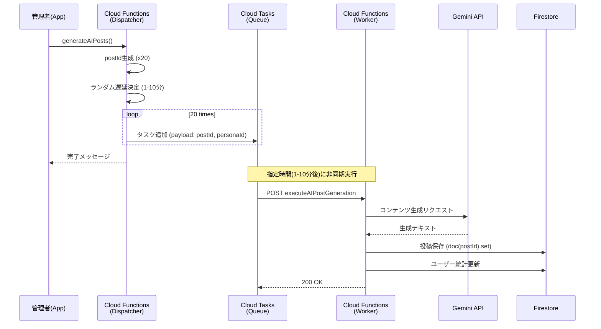

# 管理者機能（AI管理・運用ツール）設計書

## 概要
本ドキュメントでは、アプリの運営・テストを支援するために実装された「管理者機能」について記述します。
主にAIアカウントのライフサイクル管理（作成・削除）と、AIによる自動投稿生成システムの仕様を定義します。

## 1. AIアカウント管理

### 1.1 AIアカウント生成・更新 (`initializeAIAccounts`)
事前定義されたペルソナデータ（`AI_PERSONAS`）に基づき、20体のAIユーザーを一括生成または更新します。

- **トリガー**: `onCall` (管理者クライアントから呼び出し)
- **処理内容**:
    1. `AI_PERSONAS` 定数（20体）をループ処理。
    2. Gemini APIを使用して、各ペルソナの性格・職業に合わせた **Bio（自己紹介文）** を動的に生成。
    3. Firestore `users` コレクションに保存/更新。
        - `isAI: true` フラグを付与。
        - 名前、アバター、属性（年代、職業、性格）を保存。
- **目的**: テスト用データのセットアップ、AIキャラの質の向上。

### 1.2 AIアカウント全削除 (`deleteAllAIUsers`)
作成されたAIアカウントと、それに関連するデータを完全に削除します。

- **トリガー**: `onCall`
- **処理内容**:
    1. Firestore `users` コレクションから `isAI: true` のドキュメントを検索。
    2. 以下のデータをバッチ処理で削除:
        - AIのユーザープロファイル
        - AIが投稿した `posts`
        - AIが行った `comments`
        - AIが行った `reactions`
        - AIユーザーのサブコレクション（`notifications` など）
- **安全策**: 誤操作防止のため、クライアント側で「本当に削除しますか？」の確認ダイアログを実装済み。

### 1.3 フォロワー整合性チェック (`cleanUpUserFollows`)
削除されたユーザーがフォロー/フォロワーリストに残っている場合の整合性エラーを修正します。

- **トリガー**: `onCall`
- **処理内容**:
    1. 全ユーザーの `following` 配列をスキャン。
    2. 存在しないユーザーIDが含まれている場合、それを削除し、`followingCount` を再計算して更新。

## 2. AI投稿生成システム（Cloud Tasks連携）

タイムアウト（`DEADLINE_EXCEEDED`）の回避と、人間らしい自然な投稿頻度を実現するため、**Dispatcher-Workerパターン** を採用しています。

### 2.1 投稿生成ディスパッチャー (`generateAIPosts`)
投稿生成タスクをスケジュールする「司令塔」の役割を果たします。

- **トリガー**: `onCall` (管理者ボタン)
- **処理内容**:
    1. 全AIペルソナ（20体）をループ。
    2. **冪等性の担保**: 事前に `postId` を生成（`db.collection("posts").doc().id`）。
    3. **ランダム遅延**: 現在時刻から **1分〜10分** の間でランダムな実行時刻を決定。
    4. **タスク作成**: Cloud Tasks の `generate-ai-posts` キューにタスクを追加。
        - Payload: `postId`, `personaId`, `postTimeIso`

### 2.2 投稿生成ワーカー (`executeAIPostGeneration`)
実際にGemini APIを呼び出し、投稿を作成する「実務者」の役割です。

- **トリガー**: `onRequest` (Cloud Tasks からの HTTP POST)
- **URL**: `https://asia-northeast1-positive-sns.cloudfunctions.net/executeAIPostGeneration`
- **処理内容**:
    1. **認証**: 簡易的なBearerトークンチェック（将来的にはOIDC推奨）。
    2. **コンテンツ生成**: Gemini 2.0 Flash を使用し、ペルソナの性格・職業・現在の時間帯に合わせた「日常の努力・達成」に関する投稿文を生成。
    3. **投稿保存**: ディスパッチャーから受け取った `postId` を使用してFirestoreに保存（冪等性により、リトライ時の重複を防ぐ）。
    4. **統計更新**: ユーザーの `totalPosts` などを更新。

### 2.3 システム構成図



## 3. 要審査投稿レビュー

フラグ付き投稿（モデレーションで曖昧判定されたもの）を管理者がレビュー・判断する機能。

### 3.1 管理者UID
```
hYr5LUH4mhR60oQfVOggrjGYJjG2
```

### 3.2 レビュー画面
| 項目 | 詳細 |
|------|------|
| 画面 | `AdminReviewScreen` |
| ルート | `/admin/review` |
| トリガー | 🚩アイコンタップ（管理者のみ表示） |

### 3.3 アクション
- **承認**: `needsReview: false`に更新、`pendingReviews`を`reviewed: true`に
- **削除**: 投稿削除 + Storageメディア削除
- **投稿詳細**: 該当投稿画面へ遷移

### 3.4 pendingReviewsコレクション
```typescript
{
  postId: string,
  userId: string,
  reason: string,
  createdAt: Timestamp,
  reviewed: boolean,
}
```

### 3.5 Firestoreインデックス
```json
{
  "collectionGroup": "pendingReviews",
  "fields": [
    { "fieldPath": "reviewed", "order": "ASCENDING" },
    { "fieldPath": "createdAt", "order": "DESCENDING" }
  ]
}
```

## 4. 管理者通知

フラグ付き投稿発生時に管理者へ通知。

### 4.1 通知方法
| 方法 | 詳細 |
|------|------|
| **アプリ内通知** | `users/{adminId}/notifications`に追加 |
| **FCM通知** | プッシュ通知 |

### 4.2 通知データ
```typescript
{
  type: "review_needed",
  title: "要審査投稿",
  body: "フラグ付き投稿があります: {理由}",
  postId: "{postId}",
  fromUserId: "{投稿者ID}",
  fromUserName: "{投稿者名}",
}
```

## 5. 今後の拡張性
- **画像投稿**: 現在はテキストのみですが、`mediaItems` フィールドの拡張により画像付き投稿も可能です。
- **個別スケジュール**: 特定のAIのみ指定して投稿させる機能などへの拡張が容易です。
