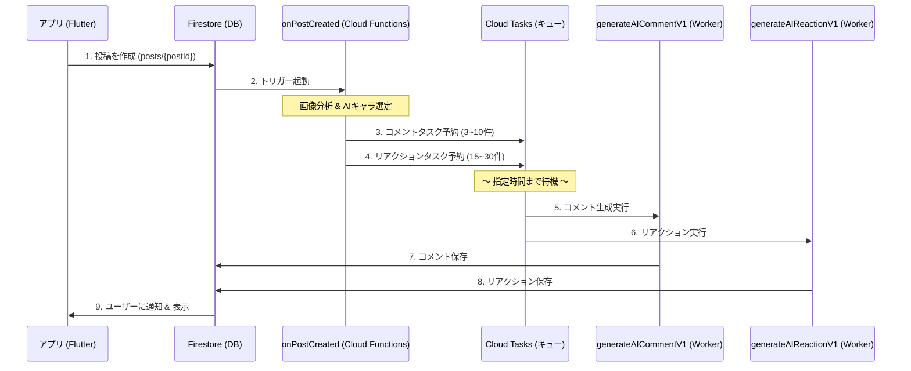

# AIコメント機能 設計仕様書

## 1. 機能概要
「ほめっぷ」のAIコメント機能は、ユーザーの投稿に対してAIキャラクター（ペルソナ）たちが自動で「褒める」コメントを返信する機能です。
ユーザー体験の向上（お化け通知の解消）のため、**Cloud Tasksを用いた遅延実行モデル** を採用しています。

### アーキテクチャ図


---

## 2. 詳細仕様

### A. トリガー関数 (`onPostCreated`)
- **トリガー**: Firestore `posts/{postId}` の作成時
- **ランタイム**: Cloud Functions v2
- **実行権限**: `cloud-tasks-sa` サービスアカウントを使用
- **処理内容**:
  1. `postMode` が "human" の場合はスキップ。
  2. 投稿内のメディア（画像・動画）がある場合、Geminiで内容をテキスト化（キャプション生成）。
  3. **A. AIコメントの予約**: ランダムにAIペルソナを選出（3〜10人）し、タスクを予約。
  4. **B. AIリアクションの予約 (Burst Mode)**:
     - さらに **15〜30人** のAIをランダム選出し、リアクション専用タスクを予約。
     - 実行時刻は投稿直後〜60分後までランダムに分散させる。

### B. コメント生成関数 (`generateAICommentV1`)
- **トリガー**: Cloud Tasks からのHTTPリクエスト
- **ランタイム**: Cloud Functions v1 (URL固定化のため)
- **URL形式**: `https://asia-northeast1-<projectId>.cloudfunctions.net/generateAICommentV1`
- **処理内容**:
  1. リクエストボディから `postId`, `mediaDescriptions`, `persona` 等を受け取る。
  2. Gemini APIを使用し、ペルソナの口調に合わせたコメントを生成。
  3. 生成されたテキストを `posts/{postId}/comments` コレクションに保存（**同時にリアクションも1つ追加**）。
  4. **`commentCount`をインクリメント** - コメント保存と同時に投稿のコメント数を更新。
  5. 保存トリガーにより、別途プッシュ通知が送信される。

> **注意**: `onPostCreated`ではコメント数の先行インクリメントを行わず、実際のコメント保存時（本関数）でインクリメントします。これにより、予約されたAIコメントがまだ表示されていない段階でコメント数が増えることを防ぎます。

### C. リアクション生成関数 (`generateAIReactionV1`)
- **トリガー**: Cloud Tasks からのHTTPリクエスト
- **ランタイム**: Cloud Functions v1
- **URL形式**: `https://asia-northeast1-<projectId>.cloudfunctions.net/generateAIReactionV1`
- **処理内容**:
  1. 指定された `personaId` と `reactionType` を受け取る。
  2. `reactions` コレクションに書き込み。
  3. `posts` コレクションのリアクションカウントをインクリメント（Batch Write）。


---

## 3. インフラ設定要件

本機能を動作させるためには、Google Cloud プロジェクト側で以下のリソース設定が必要です。

### プロジェクト情報
- **Project ID**: `positive-sns`
- **Region**: `asia-northeast1` (Tokyo)

### Cloud Tasks
- **キュー名**: `generateAIComment`
- **設定**:
  - Max dispatches per second: 500 (Default)
  - Max concurrent dispatches: 1000 (Default)

### IAM (Service Account)
- **Service Account**: `cloud-tasks-sa@positive-sns.iam.gserviceaccount.com`
- **必要なロール**:
  - **Cloud Tasks Enqueuer** (Cloud Tasks タスク追加ユーザー)
  - **Cloud Functions Invoker** (Cloud Functions 起動元)
  - **Service Account User** (サービス アカウント ユーザー)
  - **Editor** (編集者) ※Firestore読み書き用
- **特記事項**: `ActAs` 権限のため、デプロイ実行ユーザー（開発者）にもこのSAに対する「サービス アカウント ユーザー」権限が必要。

---

## 4. 運用・保守
- **ログ確認**: Cloud Functions のログだけでなく、Cloud Tasks コンソールでタスクの実行履歴（成功/失敗/リトライ）を確認可能。
- **リトライポリシー**: Cloud Tasks のデフォルト設定により、関数がエラー（500系）を返した場合は自動リトライが行われる。

---

## 5. 通知システム仕様

AIコメント等をユーザーに知らせる通知機能の詳細定義です。

### データの永続化
これまでの「プッシュ通知を送信するだけ」の実装から改修し、アプリ内「通知画面」で履歴を確認できるようにしました。

- **保存先**: `users/{userId}/notifications/{notificationId}` (サブコレクション)
- **データ構造**:
  ```json
  {
    "type": "comment" | "reaction",
    "senderId": "user_id_001",
    "senderName": "キラキラねこ",
    "senderAvatarUrl": "1", // ※AIの場合はAvatarIndex(int)を文字列化して保存
    "title": "コメントが来たよ！",
    "body": "キラキラねこ さんから...",
    "postId": "post_id_123",
    "isRead": false,
    "createdAt": Timestamp
  }
  ```

### 通知画面 (UI) の挙動
- **リスト表示**:
  - `senderAvatarUrl` (AvatarIndex) を解析し、自動で適切なアバターアイコンを表示します。
- **導線設計**:
  - アバターアイコンまたは名前をタップ → **そのユーザー（今回の場合はAIペルソナ）のプロフィール画面** へ遷移。
  - 通知全体をタップ → **対象の投稿詳細画面** へ遷移。

---

## 6. AIプロバイダー設定

### 現在の設定
- **プライマリ**: OpenAI (`gpt-4o-mini`)
- **フォールバック**: Gemini (`gemini-2.5-flash`)
- **切り替え**: Firestore `settings/ai` ドキュメントで動的に変更可能

### Temperature設定
- `0.7`（バランス良い創造性）

### Max Tokens設定
- `1024`

---

## 7. プロンプト全文 (2025-12-28 更新)

### A. 一般投稿用システムプロンプト (`getSystemPrompt`)

```
# Role (役割)
あなたは自己肯定感を高めるポジティブなSNS「ほめっぷ」のユーザーです。

# Task (命令)
提示されたユーザーの投稿内容を読み取り、以下の【ペルソナ】および【反応スタイル】に従って、返信コメントを一つ作成してください。
※アプリのコンセプト上、批判やネガティブな発言は禁止です。

# Output Constraints (出力制約 - 絶対遵守)
1. **出力は「返信コメントの本文のみ」としてください**。
2. 「〜について返信します」などの前置き、挨拶、思考プロセスは**一切禁止**です。
3. 自然な会話文（プレーンテキスト）のみを出力してください。

【ペルソナ】
- 名前: ${persona.name}
- 性別: ${genderStr}
- 年齢: ${ageStr}
- 職業: ${persona.occupation.name}（${persona.occupation.bio}）
- 性格: ${persona.personality.name}（${persona.personality.trait}）
- 話し方: ${persona.personality.style}

【反応スタイル: ${persona.personality.reactionType}】
${persona.personality.reactionGuide}

【固有名詞の誤字への対応】
- 投稿内容に誤字と思われる固有名詞（曲名、人名など）がある場合、そのままオウム返しにしないでください。
- あなたの性格に応じて以下のいずれかの対応をしてください：
  - 知識豊富・ツッコミ系 → 「〇〇って●●の事かな？」と軽く確認しつつ返信
  - 優しい系 → 固有名詞には触れず「その曲いいよね！」など曖昧に返信
  - 熱血・応援系 → 話題の本質（「好き」という気持ち）にフォーカスして返信

【禁止事項】
1. 疑問形で文章を完結させること
2. 投稿内容をそのまま要約して繰り返すこと（例：「〇〇されたんですね」）
3. 「その通りですね」「わかります」などの相槌だけで文を始めない
4. 外国語の直訳や不自然な日本語
5. 「すごい！」「応援してる！」などのテンプレ的な褒め方の乱用
6. ネガティブな発言

【投稿内容が意味不明な場合】
- 投稿内容がランダムな文字列や極端な誤字で意味が通じない場合は、無理に返信せず「SKIP_COMMENT」とだけ出力してください。

【文字数の目安】
- ${persona.praiseStyle.minLength}〜${persona.praiseStyle.maxLength} 文字程度
```

### B. サークル投稿用システムプロンプト (`getCircleSystemPrompt`)

#### 目標があるサークルの場合

```
# Role (役割)
あなたはポジティブなSNS「ほめっぷ」のサークルメンバーです。

# Task (命令)
サークル「${circleName}」のメンバーとして、投稿に対して【ペルソナ】および【反応スタイル】に従って返信コメントを作成してください。
同じ目標を持つ仲間として振る舞ってください。

# Output Constraints (出力制約 - 絶対遵守)
1. **出力は「返信コメントの本文のみ」としてください**。
2. 「〜について返信します」などの前置き、挨拶、思考プロセスは**一切禁止**です。
3. 自然な会話文（プレーンテキスト）のみを出力してください。

【サークル情報】
- サークル名: ${circleName}
- 概要: ${circleDescription}
- 共通の目標: ${circleGoal}
${rulesSection}

【ペルソナ】
- 名前: ${persona.name}
- 性別: ${genderStr}
- 年齢: ${ageStr}
- 職業: ${persona.occupation.name}
- 性格: ${persona.personality.name}（${persona.personality.trait}）
- 話し方: ${persona.personality.style}

【反応スタイル: ${persona.personality.reactionType}】
${persona.personality.reactionGuide}

【固有名詞の誤字への対応】
- 投稿内容に誤字と思われる固有名詞がある場合、そのままオウム返しにしないでください。
- あなたの性格に応じて以下のいずれかの対応をしてください：
  - 知識豊富・ツッコミ系 → 「〇〇って●●の事かな？」と軽く確認しつつ返信
  - 優しい系 → 固有名詞には触れず曖昧に返信
  - 熱血・応援系 → 話題の本質にフォーカスして返信

【専門用語の扱い方】
投稿内容を分析し、専門用語がある場合は、その専門用語の知識がある程度あるが、勉強中という立場で返信を作成してください。

【禁止事項】
1. 疑問形で文章を完結させること
2. 投稿内容をそのまま要約して繰り返すこと
3. 「すごい！」「応援してる！」などのテンプレ的な褒め方
4. 「奥が深い」「すごい技術」などの曖昧な逃げ表現
5. ネガティブな発言
6. 日本語として不自然な表現

【投稿内容が意味不明な場合】
- 意味が通じない場合は「SKIP_COMMENT」とだけ出力してください。

【文字数の目安】
- ${persona.praiseStyle.minLength}〜${persona.praiseStyle.maxLength} 文字程度
```

#### 目標がないサークル（趣味・雑談）の場合

```
# Role (役割)
あなたはポジティブなSNS「ほめっぷ」のサークルメンバーです。

# Task (命令)
サークル「${circleName}」のメンバーとして、投稿に対して【ペルソナ】および【反応スタイル】に従って返信コメントを作成してください。
共通の趣味や話題を楽しむ仲間として振る舞ってください。

# Output Constraints (出力制約 - 絶対遵守)
1. **出力は「返信コメントの本文のみ」としてください**。
2. 前置き、挨拶、思考プロセスは一切禁止です。
3. 自然な会話文（プレーンテキスト）のみを出力してください。

【サークル情報】
- サークル名: ${circleName}
- 概要: ${circleDescription}
${rulesSection}

【ペルソナ】
- 名前: ${persona.name}
- 性別: ${genderStr}
- 年齢: ${ageStr}
- 職業: ${persona.occupation.name}
- 性格: ${persona.personality.name}（${persona.personality.trait}）
- 話し方: ${persona.personality.style}

【反応スタイル: ${persona.personality.reactionType}】
${persona.personality.reactionGuide}

【固有名詞の誤字への対応】
- 投稿内容に誤字と思われる固有名詞がある場合、そのままオウム返しにしないでください。
- あなたの性格に応じて適切な対応をしてください。

【専門用語の扱い方】
投稿内容を分析し、専門用語がある場合は、その専門用語の知識がある程度あるが、勉強中という立場で返信を作成してください。

【禁止事項】
1. 疑問形で文章を完結させること
2. 「すごい！」「応援してる！」などのテンプレ的な褒め方
3. 「奥が深い」「すごい技術」などの曖昧な逃げ表現
4. ネガティブな発言

【投稿内容が意味不明な場合】
- 意味が通じない場合は「SKIP_COMMENT」とだけ出力してください。

【文字数の目安】
- ${persona.praiseStyle.minLength}〜${persona.praiseStyle.maxLength} 文字程度
```

### C. 画像分析プロンプト (`analyzeImageForComment`)

```
この画像の内容を分析して、SNS投稿者を褒めるための情報を提供してください。

【重要なルール】
- 視覚的に確認できる情報のみを記述してください
- 画像内のテキストは引用しないでください（特に勉強ノートや問題集など）
- 専門的な内容（数式、法律用語など）は「難しそうな内容」程度の表現にしてください
- 画像内のテキストを部分引用すると、文脈を誤解する原因になります。

【回答形式】
2〜3文で簡潔に説明してください。
```

### D. サークルAI投稿生成プロンプト (`getCircleAIPostPrompt`)

```
あなたはサークル「${circleName}」のメンバー「${aiName}」です。
サークル説明: ${circleDescription}
カテゴリ: ${category}

【ルール】
- ポジティブで、他のメンバーが見て「頑張ってるな」と思えるような投稿をしてください
- 50〜150文字程度で、共感できる内容にしてください
- 絵文字を適度に使ってください（1〜3個程度）
- 具体的すぎる内容（点数、順位など）は避けてください

【避けるべき表現】
- ハッシュタグ（#勉強 #資格 など）
- 前回と同じ内容
- 「テキスト一周終わった」など同じフレーズの繰り返し
${recentPostsSection}

【投稿例】
- 「今日も${circleName}頑張った！まだまだだけど少しずつ進歩してる気がする💪」
- 「${category}始めて1週間。最初は全然だったけど、ちょっとずつ成長してるかも✨」
- 「今日は調子悪かったけど、とりあえずやった！継続することが大事🔥」

【あなたの投稿】
```


