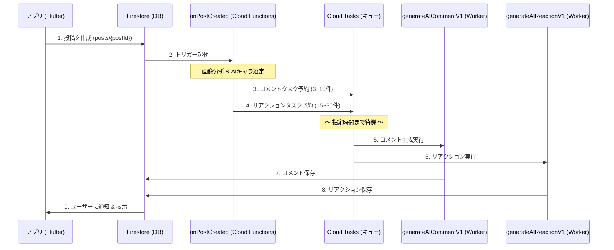

# AIコメント機能 設計仕様書

## 1. 機能概要
「ほめっぷ」のAIコメント機能は、ユーザーの投稿に対してAIキャラクター（ペルソナ）たちが自動で「褒める」コメントを返信する機能です。
ユーザー体験の向上（お化け通知の解消）のため、**Cloud Tasksを用いた遅延実行モデル** を採用しています。

### アーキテクチャ図


---

## 2. 詳細仕様

### A. トリガー関数 (`onPostCreated`)
- **トリガー**: Firestore `posts/{postId}` の作成時
- **ランタイム**: Cloud Functions v2
- **実行権限**: `cloud-tasks-sa` サービスアカウントを使用
- **処理内容**:
  1. `postMode` が "human" の場合はスキップ。
  2. 投稿内のメディア（画像・動画）がある場合、Geminiで内容をテキスト化（キャプション生成）。
  3. **A. AIコメントの予約**: ランダムにAIペルソナを選出（3〜10人）し、タスクを予約。
  4. **B. AIリアクションの予約 (Burst Mode)**:
     - さらに **15〜30人** のAIをランダム選出し、リアクション専用タスクを予約。
     - 実行時刻は投稿直後〜60分後までランダムに分散させる。

### B. コメント生成関数 (`generateAICommentV1`)
- **トリガー**: Cloud Tasks からのHTTPリクエスト
- **ランタイム**: Cloud Functions v1 (URL固定化のため)
- **URL形式**: `https://asia-northeast1-<projectId>.cloudfunctions.net/generateAICommentV1`
- **処理内容**:
  1. リクエストボディから `postId`, `mediaDescriptions`, `persona` 等を受け取る。
  2. Gemini APIを使用し、ペルソナの口調に合わせたコメントを生成。
  3. 生成されたテキストを `posts/{postId}/comments` コレクションに保存（**同時にリアクションも1つ追加**）。
  4. 保存トリガーにより、別途プッシュ通知が送信される。

### C. リアクション生成関数 (`generateAIReactionV1`)
- **トリガー**: Cloud Tasks からのHTTPリクエスト
- **ランタイム**: Cloud Functions v1
- **URL形式**: `https://asia-northeast1-<projectId>.cloudfunctions.net/generateAIReactionV1`
- **処理内容**:
  1. 指定された `personaId` と `reactionType` を受け取る。
  2. `reactions` コレクションに書き込み。
  3. `posts` コレクションのリアクションカウントをインクリメント（Batch Write）。


---

## 3. インフラ設定要件

本機能を動作させるためには、Google Cloud プロジェクト側で以下のリソース設定が必要です。

### プロジェクト情報
- **Project ID**: `positive-sns`
- **Region**: `asia-northeast1` (Tokyo)

### Cloud Tasks
- **キュー名**: `generateAIComment`
- **設定**:
  - Max dispatches per second: 500 (Default)
  - Max concurrent dispatches: 1000 (Default)

### IAM (Service Account)
- **Service Account**: `cloud-tasks-sa@positive-sns.iam.gserviceaccount.com`
- **必要なロール**:
  - **Cloud Tasks Enqueuer** (Cloud Tasks タスク追加ユーザー)
  - **Cloud Functions Invoker** (Cloud Functions 起動元)
  - **Service Account User** (サービス アカウント ユーザー)
  - **Editor** (編集者) ※Firestore読み書き用
- **特記事項**: `ActAs` 権限のため、デプロイ実行ユーザー（開発者）にもこのSAに対する「サービス アカウント ユーザー」権限が必要。

---

## 4. 運用・保守
- **ログ確認**: Cloud Functions のログだけでなく、Cloud Tasks コンソールでタスクの実行履歴（成功/失敗/リトライ）を確認可能。
- **リトライポリシー**: Cloud Tasks のデフォルト設定により、関数がエラー（500系）を返した場合は自動リトライが行われる。

---

## 5. 通知システム仕様

AIコメント等をユーザーに知らせる通知機能の詳細定義です。

### データの永続化
これまでの「プッシュ通知を送信するだけ」の実装から改修し、アプリ内「通知画面」で履歴を確認できるようにしました。

- **保存先**: `users/{userId}/notifications/{notificationId}` (サブコレクション)
- **データ構造**:
  ```json
  {
    "type": "comment" | "reaction",
    "senderId": "user_id_001",
    "senderName": "キラキラねこ",
    "senderAvatarUrl": "1", // ※AIの場合はAvatarIndex(int)を文字列化して保存
    "title": "コメントが来たよ！",
    "body": "キラキラねこ さんから...",
    "postId": "post_id_123",
    "isRead": false,
    "createdAt": Timestamp
  }
  ```

### 通知画面 (UI) の挙動
- **リスト表示**:
  - `senderAvatarUrl` (AvatarIndex) を解析し、自動で適切なアバターアイコンを表示します。
- **導線設計**:
  - アバターアイコンまたは名前をタップ → **そのユーザー（今回の場合はAIペルソナ）のプロフィール画面** へ遷移。
  - 通知全体をタップ → **対象の投稿詳細画面** へ遷移。
