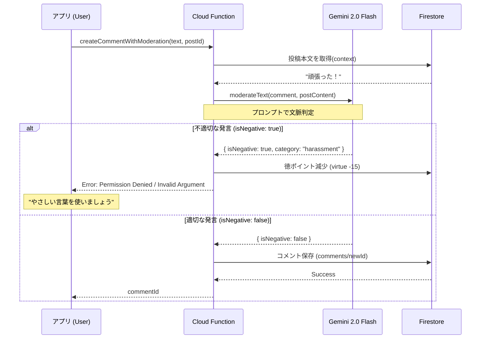

# コメント機能・モデレーション設計仕様書

## 1. 概要
ユーザー間のコミュニケーションを促進する「コメント機能」と、安心・安全なコミュニティを維持するための「AIモデレーションシステム」についての設計仕様です。
「ほめっぷ」のコンセプトである「ポジティブで優しい世界」を守るため、攻撃的な発言を未然に防ぐ仕組みを導入しています。

## 2. コメント投稿フロー

ユーザーがコメントを送信する際、以下のステップで処理が行われます。

1.  **アプリ**: ユーザーがコメントを入力し送信ボタンを押下。
2.  **Cloud Functions**: `createCommentWithModeration` 関数を呼び出し。
3.  **AI判定 (Gemini)**: 投稿内容（文脈）とコメント内容を照らし合わせ、不適切かどうかを判定。
4.  **結果分岐**:
    *   **承認 (Safe)**: コメントをFirestoreに保存し、成功を返す。
    *   **拒否 (Unsafe)**: エラーを返し、Firestoreには保存しない。

## 3. コンテキスト考慮型モデレーション

単語の禁止リストだけでなく、**投稿内容（文脈）** を考慮して判定を行います。

### 判定ロジック
*   **使用モデル**: Google Gemini 2.0 Flash
*   **プロンプト構成**:
    *   役割: SNSコミュニティマネージャー
    *   入力: 「投稿本文」と「コメント内容」
    *   基準:
        *   直接的な暴言（死ね、殺すなど）は即NG。
        *   文脈によって嫌味や攻撃となる表現もNG（例: 頑張った投稿に「だから？」など）。
*   **判定カテゴリ**:
    *   `harassment` (誹謗中傷)
    *   `hate_speech` (差別)
    *   `profanity` (暴言)
    *   `self_harm` (自傷助長)
    *   `spam` (スパム)

## 4. 徳ポイントシステム (Virtue System)

ユーザーの善行・悪行をスコア化し、悪質なユーザーのアクションを制限します。

### ペナルティ
*   **ネガティブ発言検出時**: `virtue` ポイントを **15pt** 減少。
*   **BAN判定**: `virtue` が **0** になった場合（または特定閾値以下）、`isBanned: true` となり、以降のコメント投稿ができなくなる。

### エラーハンドリング
BANされたユーザーがコメントしようとすると、Cloud Functionsは `permission-denied` エラーを返し、アプリ側で「申し訳ありませんが、現在コメントできません」等のメッセージを表示する。

## 5. データ構造

### comments コレクション
`comments/{commentId}`

| Field | Type | Description |
| :--- | :--- | :--- |
| `postId` | string | 対象の投稿ID |
| `userId` | string | コメントしたユーザーID |
| `userDisplayName` | string | ユーザー名（スナップショット） |
| `userAvatarIndex` | number | アバターID |
| `content` | string | コメント本文 |
| `isAI` | boolean | AIによるコメントか否か |
| `isVisibleNow` | boolean | 即時表示フラグ（AIコメントの場合は予約投稿のためfalseもあり得る） |
| `createdAt` | timestamp | 作成日時 |

### users コレクション (関連フィールド)
`users/{userId}`

| Field | Type | Description |
| :--- | :--- | :--- |
| `virtue` | number | 現在の徳ポイント (0-100) |
| `isBanned` | boolean | アカウント停止フラグ |

---

## 6. 今後の拡張予定
*   **警告機能**: モデレーションでNGになった際、具体的な改善案（言い換え）をユーザーに提示する。
*   **再審査リクエスト**: 誤判定の救済措置。
