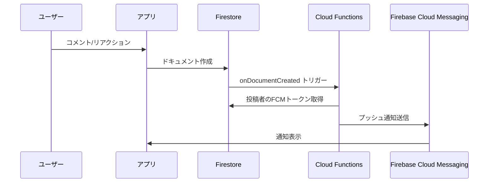
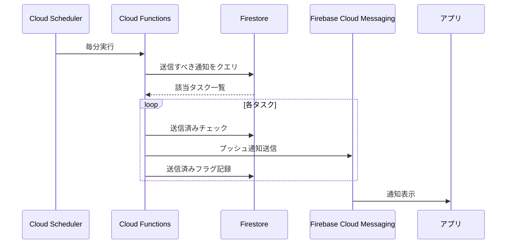

# 通知機能 設計書

## 概要
ほめっぷアプリにおける通知機能の設計をまとめます。

---

## 通知の種類

| 通知タイプ | トリガー | 表示内容 | 備考 |
|-----------|---------|---------|------|
| コメント通知 | コメント作成時 | `{名前}さんがコメントしました` | Firestoreトリガー |
| リアクション通知 | リアクション追加時 | `{名前}さんがリアクションしました` | Firestoreトリガー |
| タスクリマインダー | 設定時刻の前 | 🔔 タスクリマインダー | スケジュール実行 |
| タスク予定時刻通知 | 予定時刻ちょうど | 📋 タスクの時間です | スケジュール実行 |
| サークル参加承認 | 参加申請承認時 | `{サークル名}への参加が承認されました！` | オーナー操作 |
| サークル参加拒否 | 参加申請拒否時 | `{サークル名}への参加申請は承認されませんでした` | オーナー操作 |
| サークル参加申請 | 参加申請時 | `{申請者名}さんが{サークル名}への参加を申請しました` | オーナーへ通知 |

---

## アーキテクチャ

### イベントドリブン通知（コメント・リアクション）



### スケジュール通知（タスクリマインダー）



---

## Cloud Functions 実装

### コメント通知 (`onCommentCreatedNotify`)
- **トリガー**: `comments/{commentId}` ドキュメント作成時
- **処理**: 投稿者にプッシュ通知を送信
- **除外条件**: 自分へのコメント、スケジュール投稿

### リアクション通知 (`onReactionAddedNotify`)
- **トリガー**: `reactions/{reactionId}` ドキュメント作成時
- **処理**: 投稿者にプッシュ通知を送信
- **除外条件**: 自分へのリアクション

### タスクリマインダー (`sendTaskReminders`)
- **トリガー**: Cloud Scheduler（毎分実行）
- **処理**:
  1. 今後24時間以内の未完了タスクを取得
  2. 各タスクのリマインダー設定をチェック
  3. 送信時刻が過去1分以内なら通知送信
  4. 予定時刻ちょうどの場合も通知送信
- **重複防止**: `sentReminders` コレクションで送信済みを記録

---

## データ構造

### ユーザー (`users`)
```json
{
  "fcmToken": "string",
  "fcmTokenUpdatedAt": "timestamp"
}
```

### 送信済みリマインダー (`sentReminders`)
```json
{
  "taskId": "string",
  "userId": "string",
  "reminderKey": "minutes_30 | hours_1 | on_time",
  "sentAt": "timestamp"
}
```

### タスクのリマインダー設定
```json
{
  "reminders": [
    { "unit": "minutes", "value": 30 },
    { "unit": "hours", "value": 1 }
  ]
}
```

---

## クライアント側実装

### NotificationService (`notification_service.dart`)
- FCMトークンの取得・保存
- フォアグラウンドメッセージ処理
- ローカル通知表示
- 通知タップ時のナビゲーション

### 通知画面 (`notifications_screen.dart`)
- **表示形式**: 本文のみ表示（タイトルは使用しない）
- **アバター**: 送信者のアバターを左に表示（タップでプロフィール遷移）
- **未読マーク**: 赤いドット表示
- **タップ**: 関連投稿/サークルに遷移

### 通知チャンネル (Android)
| チャンネルID | 名前 | 用途 |
|-------------|------|------|
| `default_channel` | デフォルト | 一般通知 |
| `task_reminders` | タスクリマインダー | タスク通知 |

---

## カテゴリ分け機能

### タブ構成

| タブ | カテゴリ | 含まれる通知タイプ |
|------|---------|-------------------|
| すべて | `all` | 全通知 |
| TL | `timeline` | comment, reaction, system |
| サークル | `circle` | joinRequestReceived, joinRequestApproved, joinRequestRejected, circleDeleted |
| タスク | `task` | taskReminder, taskScheduled |

### 未読バッジ

- 各タブに未読件数を赤丸バッジで表示
- 99件を超える場合は「99」と表示

### レスポンシブ対応

- `isScrollable: true` で狭い画面でも横スクロール可能
- `tabAlignment: TabAlignment.center` で中央寄せ

---

## Firestore インデックス

タスクリマインダー機能に必要なインデックス：
- `tasks` コレクション
  - `isCompleted` (ASC) + `scheduledAt` (ASC)

---

## 通知の匿名化（AIバレ防止）

| 悪い例 | 良い例 |
|--------|--------|
| 「ゆうきさんからコメントが届きました！」 | 「投稿にコメントがつきました！」 |

送信者名を表示するとAIアカウントがバレるリスクがあるため、可能な限り匿名化します。

---

## 関連ファイル

### Cloud Functions
- [index.ts](file:///c:/Dev/homeppu/functions/src/index.ts)
  - `sendPushNotification` - プッシュ通知送信ヘルパー
  - `onCommentCreatedNotify` - コメント通知
  - `onReactionAddedNotify` - リアクション通知
  - `sendTaskReminders` - タスクリマインダー

### クライアント
- [notification_service.dart](file:///c:/Dev/homeppu/lib/shared/services/notification_service.dart)
